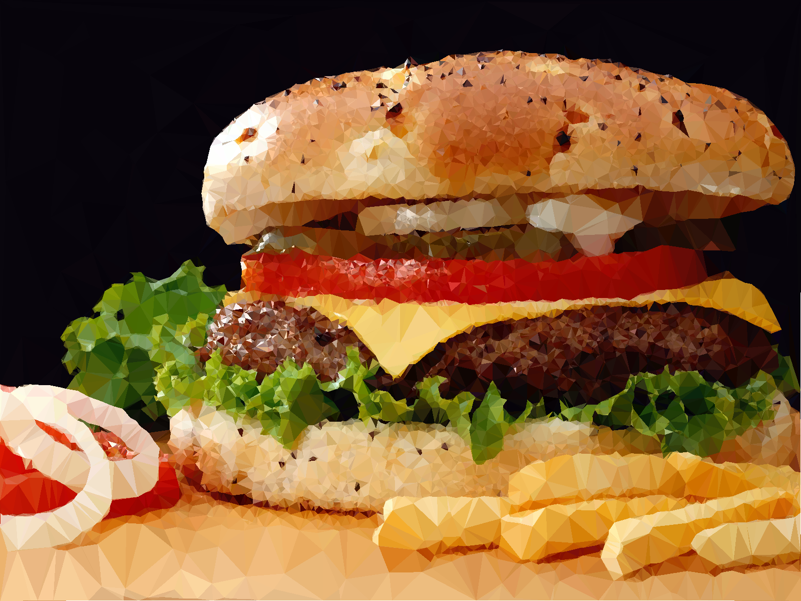
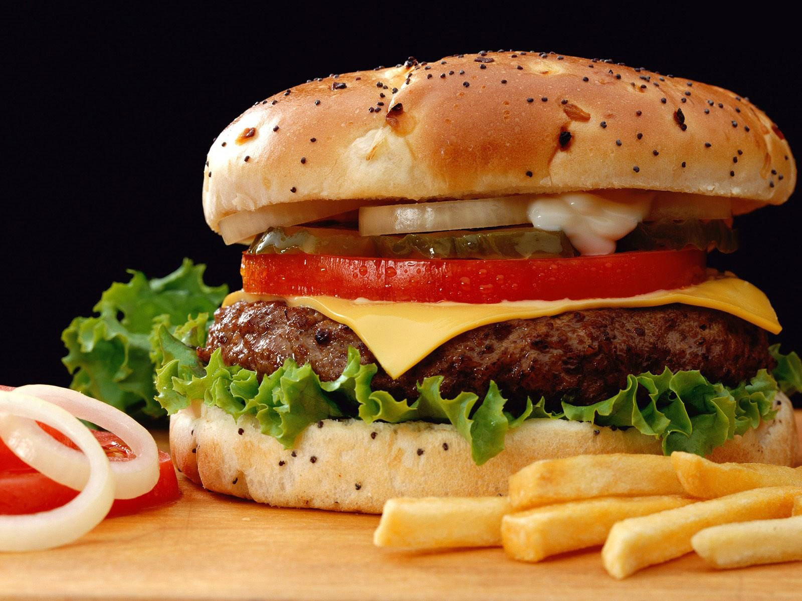

# Lowpoly Style Image Generator
Low poly is a polygon mesh in 3D computer graphics that has a relatively small number of polygons. Low poly meshes occur in real-time applications (e.g. games) as contrast with high poly meshes in animated movies and special effects of the same era. The term low poly is used in both a technical and a descriptive sense; the number of polygons in a mesh is an important factor to optimize for performance but can give an undesirable appearance to the resulting graphics.

## Table of Contents
- [Rendering](#Rendering)
- [Usage](#Usage)
- [Parameters](#Parameters)
- [Principle Introduction](#Principle-Introduction)

## Rendering
### After

### Before


## Usage
```
Configure config = Parser.parseParam("config/config.param");
LowPoly.generate(inputStream, outputStream, config);
```
## Parameters
Three parameters are defined in the file config/config.param, explained as follows:
- pointCount: the number of random sampling points.
- accuracy: the smaller the value, the higher the accuracy.
- fill: whether to fill the color, only draw lines when false.

## Principle Introduction
1. The edge information of the picture is extracted, and the commonly used edge detection algorithm is Sobel algorithm. If you only extract edge information, a very sharp triangle may appear when you draw a triangle later. In order to reduce the possibility of this situation, it is necessary to add several random sampling points.
2. The selected point sets are combined into several triangles using the Delaunay triangulation algorithm. Delaunay triangulation has the characteristics of maximizing the minimum angle, closest to the regularized triangulation and uniqueness (any four points cannot be co-circular).
3. Coloring. Use the color at the center of gravity of each triangle as the color of the entire triangle. The calculation of the position of the center of gravity is very simple, that is, the arithmetic mean of the coordinates of the vertices.